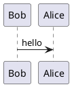

# Project Documentation

Documentação completa do projeto construída com MkDocs e tema shadcn/ui.

## Começando

### Pré-requisitos

- Python 3.8 ou superior
- pip (gerenciador de pacotes Python)

### Instalação Rápida

```bash
# Instalar Python e dependências
make install

# Iniciar servidor de desenvolvimento
make serve
```

A documentação estará disponível em: http://127.0.0.1:8000

## Comandos Disponíveis

### make install

Instala o Python (se necessário) e todas as dependências do MkDocs.

```bash
make install
```

**O que faz:**
- Detecta seu sistema operacional
- Instala Python se não estiver disponível (macOS/Linux)
- Instala todas as dependências do `requirements.txt`
- Configura o ambiente

### make serve

Inicia o servidor de desenvolvimento com hot-reload.

```bash
make serve
```

**Acesse:** http://127.0.0.1:8000

O servidor recarrega automaticamente quando você edita os arquivos.

### make build

Gera o build estático da documentação.

```bash
make build
```

Os arquivos HTML serão gerados na pasta `site/`.

### make clean

Remove arquivos de build.

```bash
make clean
```

## Estrutura do Projeto

```
docs/
├── mkdocs.yml              # Configuração do MkDocs
├── Makefile                # Comandos de automação
├── requirements.txt        # Dependências Python
├── README.md              # Este arquivo
└── docs/                  # Arquivos de documentação
    ├── index.md           # Página inicial
    ├── inicio-rapido.md   # Guia de início rápido
    ├── arquitetura/       # Documentação de arquitetura
    │   ├── visao-geral.md
    │   └── guia-desenvolvimento.md
    ├── api/               # Referências da API
    │   ├── index.md
    │   ├── endpoint-exemplo-1.md
    │   └── endpoint-exemplo-2.md
    ├── operacoes/         # Guias operacionais
    │   ├── monitoramento.md
    │   ├── troubleshooting.md
    │   └── runbooks.md
    ├── tutoriais/         # Tutoriais práticos
    │   ├── index.md
    │   └── tutorial-exemplo.md
    ├── faq.md            # Perguntas frequentes
    └── assets/           # Recursos estáticos
        └── diagrams/     # Diagramas PlantUML
            ├── api-exemplo-1.puml
            └── api-exemplo-2.puml
```

## Personalizando

### Configurações Básicas

Edite `mkdocs.yml` para personalizar:

```yaml
site_name: Seu Projeto
site_description: Descrição do seu projeto
site_author: Seu Nome

repo_url: https://github.com/seu-usuario/seu-repo
```

### Tema shadcn/ui

O projeto usa o [tema shadcn](https://asiffer.github.io/mkdocs-shadcn/), inspirado no shadcn/ui, moderno e elegante.

Para personalizar:

```yaml
theme:
  name: shadcn
```

**Extensões suportadas:**
- ✅ admonition
- ✅ codehilite
- ✅ fenced_code
- ✅ footnotes
- ✅ pymdownx.tabbed
- ✅ pymdownx.blocks.details
- ✅ pymdownx.progressbar
- ✅ pymdownx.arithmatex
- ✅ shadcn.iconify (ícones)
- ✅ shadcn.echarts (gráficos)

### Adicionar Novas Páginas

1. Crie um arquivo `.md` na pasta `docs/`
2. Adicione na navegação em `mkdocs.yml`:

```yaml
nav:
  - Home: index.md
  - Sua Nova Página: nova-pagina.md
```

### Usar Diagramas PlantUML

Este projeto usa [`mkdocs_puml`](https://github.com/MikhailKravets/mkdocs_puml) para renderizar diagramas PlantUML.

**Opção 1: Arquivo .puml separado**
1. Crie um arquivo `.puml` em `docs/assets/diagrams/`
2. Inclua no markdown:

```markdown
```plantuml
@startuml
!include ../assets/diagrams/seu-diagrama.puml
@enduml
\```
```

**Opção 2: Inline no markdown**

````markdown

````

## Recursos do Material Theme

### Admonitions

```markdown
!!! note "Título"
    Conteúdo da nota

!!! warning "Atenção"
    Conteúdo do aviso

!!! tip "Dica"
    Conteúdo da dica
```

### Tabs

```markdown
=== "Tab 1"

    Conteúdo do tab 1

=== "Tab 2"

    Conteúdo do tab 2
```

### Code com Annotations

```markdown
``` python
def hello():  # (1)
    print("Hello")
```

1. Esta é uma anotação explicativa
\```
```

## Deploy

### GitHub Pages

```bash
# Build
make build

# Deploy para GitHub Pages
mkdocs gh-deploy
```

### Docker

```dockerfile
FROM squidfunk/mkdocs-material:latest

COPY . /docs
WORKDIR /docs

EXPOSE 8000
CMD ["serve", "--dev-addr=0.0.0.0:8000"]
```

```bash
# Build da imagem
docker build -t mkdocs-docs .

# Run
docker run -p 8000:8000 mkdocs-docs
```

### Servidor Web (Nginx)

```bash
# Build
make build

# Copiar para servidor
scp -r site/* user@server:/var/www/html/docs/
```

## Dicas e Truques

### Hot Reload Não Funciona?

```bash
# Use --dirty para rebuilds mais rápidos
mkdocs serve --dirty

# Ou especifique o host
mkdocs serve --dev-addr=0.0.0.0:8000
```

### Build Lento?

```bash
# Use --dirty para builds incrementais
mkdocs build --dirty
```

### Verificar Links Quebrados

```bash
# Instalar plugin
pip install mkdocs-linkcheck

# Adicionar ao mkdocs.yml
plugins:
  - linkcheck
```

## Troubleshooting

### Erro: "ModuleNotFoundError: No module named 'mkdocs'"

```bash
# Reinstale as dependências
make install
```

### Erro: "Permission denied"

```bash
# No Linux/macOS, você pode precisar de permissões
chmod +x Makefile
```

### Plugins não Funcionam

```bash
# Verifique se instalou todas as dependências
pip install -r requirements.txt

# Ou reinstale um plugin específico
pip install mkdocs-plantuml-plugin --upgrade
```

### PlantUML não Renderiza

Certifique-se de que está usando o servidor PlantUML online ou instale localmente:

```bash
# macOS
brew install plantuml

# Linux
sudo apt-get install plantuml
```

Depois atualize `mkdocs.yml`:

```yaml
plugins:
  - plantuml:
      puml_url: http://localhost:8080/plantuml/
      # Ou use o servidor online (padrão)
      puml_url: https://www.plantuml.com/plantuml/
```

## Contribuindo

1. Fork este repositório
2. Crie uma branch para sua feature (`git checkout -b feature/MinhaFeature`)
3. Commit suas mudanças (`git commit -am 'Adiciona MinhaFeature'`)
4. Push para a branch (`git push origin feature/MinhaFeature`)
5. Abra um Pull Request

## Recursos

### Documentação Oficial

- [MkDocs](https://www.mkdocs.org/)
- [shadcn Theme](https://asiffer.github.io/mkdocs-shadcn/)
- [mkdocs_puml](https://mikhailkravets.github.io/mkdocs_puml/)
- [PlantUML](https://plantuml.com/)

### Exemplos

- [shadcn Theme Demo](https://asiffer.github.io/mkdocs-shadcn/)
- [mkdocs_puml Examples](https://mikhailkravets.github.io/mkdocs_puml/)
- [Markdown Guide](https://www.markdownguide.org/)

### Comunidade

- [shadcn GitHub](https://github.com/asiffer/mkdocs-shadcn)
- [mkdocs_puml GitHub](https://github.com/MikhailKravets/mkdocs_puml)

## Licença

[Sua licença aqui]

## Suporte

- **Email:** support@yourproject.com
- **Issues:** [GitHub Issues](https://github.com/your-org/your-repo/issues)
- **Slack:** [Join our Slack](#)

---

Criado com ❤️ usando [MkDocs](https://www.mkdocs.org/) + [shadcn Theme](https://asiffer.github.io/mkdocs-shadcn/) + [mkdocs_puml](https://github.com/MikhailKravets/mkdocs_puml)

