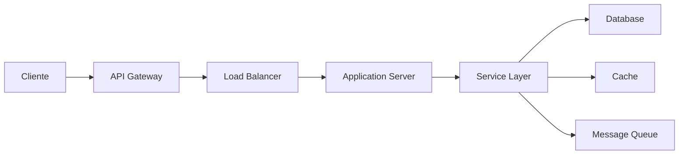
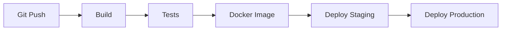

# Visão Geral da Arquitetura

Esta página apresenta uma visão geral da arquitetura do sistema, seus componentes principais e como eles interagem entre si.

## Diagrama de Arquitetura

Abaixo está o diagrama completo da arquitetura do sistema:

<div style="border: 1px solid #ddd; border-radius: 4px; overflow: hidden; margin: 20px 0;">
    <iframe 
        src="https://viewer.diagrams.net/?tags=%7B%7D&highlight=0000ff&edit=_blank&layers=1&nav=1&title=architecture.drawio#Uhttps%3A%2F%2Fdrive.google.com%2Fuc%3Fid%3DYOUR_DRAWIO_FILE_ID%26export%3Ddownload"
        width="100%" 
        height="600px" 
        frameborder="0" 
        allowfullscreen>
    </iframe>
</div>

!!! info "Editando o Diagrama"
    Para editar o diagrama acima:
    
    1. Crie/edite seu diagrama no [draw.io](https://app.diagrams.net/)
    2. Salve o arquivo no Google Drive ou GitHub
    3. Obtenha o link público do arquivo
    4. Substitua `YOUR_DRAWIO_FILE_ID` no iframe acima

## Componentes Principais

### 1. Frontend Layer

**Responsabilidades:**
- Interface do usuário
- Validação de formulários
- Gerenciamento de estado
- Comunicação com API

**Tecnologias:**
- React/Vue.js/Angular
- TypeScript
- Redux/Vuex
- Axios/Fetch API

### 2. API Gateway

**Responsabilidades:**
- Roteamento de requisições
- Autenticação e autorização
- Rate limiting
- Load balancing

**Tecnologias:**
- NGINX
- Kong/Traefik
- OAuth2/JWT

### 3. Application Layer

**Responsabilidades:**
- Lógica de negócio
- Processamento de dados
- Orquestração de serviços
- Validação de regras

**Tecnologias:**
- Python (FastAPI/Django)
- Node.js (Express)
- Java (Spring Boot)

### 4. Service Layer

**Responsabilidades:**
- Microserviços especializados
- Processamento assíncrono
- Integração com sistemas externos
- Cache e otimização

**Componentes:**
- **Auth Service**: Autenticação e autorização
- **User Service**: Gerenciamento de usuários
- **Notification Service**: Envio de notificações
- **Payment Service**: Processamento de pagamentos

### 5. Data Layer

**Responsabilidades:**
- Persistência de dados
- Backup e recuperação
- Otimização de queries
- Replicação

**Tecnologias:**
- PostgreSQL (dados relacionais)
- MongoDB (dados não-relacionais)
- Redis (cache)
- Elasticsearch (busca)

## Fluxo de Dados



### Fluxo Típico de Requisição

1. **Cliente** envia requisição HTTP/HTTPS
2. **API Gateway** autentica e roteia a requisição
3. **Load Balancer** distribui para servidor disponível
4. **Application Server** processa a lógica de negócio
5. **Service Layer** executa operações específicas
6. **Data Layer** persiste ou recupera dados
7. Resposta retorna pelo mesmo caminho

## Padrões Arquiteturais

### Microserviços

O sistema é dividido em serviços independentes que se comunicam via APIs REST ou mensageria.

**Vantagens:**
- Escalabilidade independente
- Deploy isolado
- Tecnologias específicas por serviço
- Resiliência

### Event-Driven Architecture

Comunicação assíncrona entre serviços usando eventos.

**Componentes:**
- Event Bus (RabbitMQ/Kafka)
- Event Producers
- Event Consumers
- Event Store

### CQRS (Command Query Responsibility Segregation)

Separação entre operações de leitura e escrita.

**Implementação:**
- Write Model: Otimizado para escrita
- Read Model: Otimizado para consultas
- Event Sourcing para sincronia

## Infraestrutura

### Containerização

Todos os serviços são containerizados usando Docker.

```yaml
version: '3.8'
services:
  app:
    image: your-app:latest
    ports:
      - "8000:8000"
    environment:
      - DATABASE_URL=${DATABASE_URL}
```

### Orquestração

Kubernetes para gerenciamento de containers em produção.

**Recursos:**
- Auto-scaling
- Self-healing
- Load balancing
- Rolling updates

### CI/CD

Pipeline automatizado para build, test e deploy.



## Segurança

### Camadas de Segurança

1. **Network Layer**: Firewall, VPN, DDoS protection
2. **Application Layer**: WAF, Input validation
3. **Data Layer**: Encryption at rest, Encryption in transit
4. **Authentication**: OAuth2, JWT, MFA
5. **Authorization**: RBAC, Policy-based access

### Práticas de Segurança

- Secrets management (Vault)
- Regular security audits
- Dependency scanning
- Penetration testing
- Security headers

## Monitoramento e Observabilidade

### Métricas

- Application metrics (Prometheus)
- Business metrics (Custom dashboards)
- Infrastructure metrics (CloudWatch/DataDog)

### Logs

- Centralized logging (ELK Stack)
- Structured logging (JSON)
- Log levels apropriados

### Tracing

- Distributed tracing (Jaeger/Zipkin)
- Request correlation IDs
- Performance profiling

## Escalabilidade

### Horizontal Scaling

Adição de mais instâncias do serviço.

**Estratégias:**
- Auto-scaling baseado em métricas
- Load balancing
- Stateless services

### Vertical Scaling

Aumento de recursos (CPU, RAM) por instância.

**Quando usar:**
- Database servers
- Cache servers
- Serviços com estado

## Disaster Recovery

### Backup Strategy

- **RTO** (Recovery Time Objective): 1 hora
- **RPO** (Recovery Point Objective): 15 minutos
- Backups diários automatizados
- Replicação cross-region

### Failover

- Active-passive configuration
- Automated health checks
- DNS failover
- Database replication

## Próximos Passos

- [Guia de Desenvolvimento](guia-desenvolvimento.md) - Padrões e práticas de desenvolvimento
- [Referências de API](../api/index.md) - Documentação detalhada das APIs
- [Operações](../operacoes/monitoramento.md) - Guias operacionais

