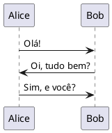
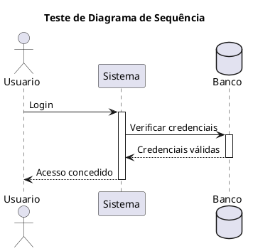
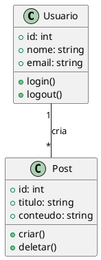
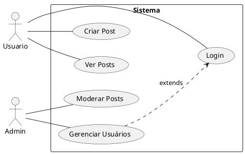

# Teste PlantUML

Esta página testa se o PlantUML está funcionando corretamente.

## Teste 1: Diagrama Simples

## Teste 2: Diagrama de Sequência

## Teste 3: Diagrama de Classes

## Teste 4: Diagrama de Caso de Uso

---

**Se você vê os diagramas acima, o PlantUML está funcionando! ✅**

**Se você vê apenas o código, há um problema de configuração. ❌**

